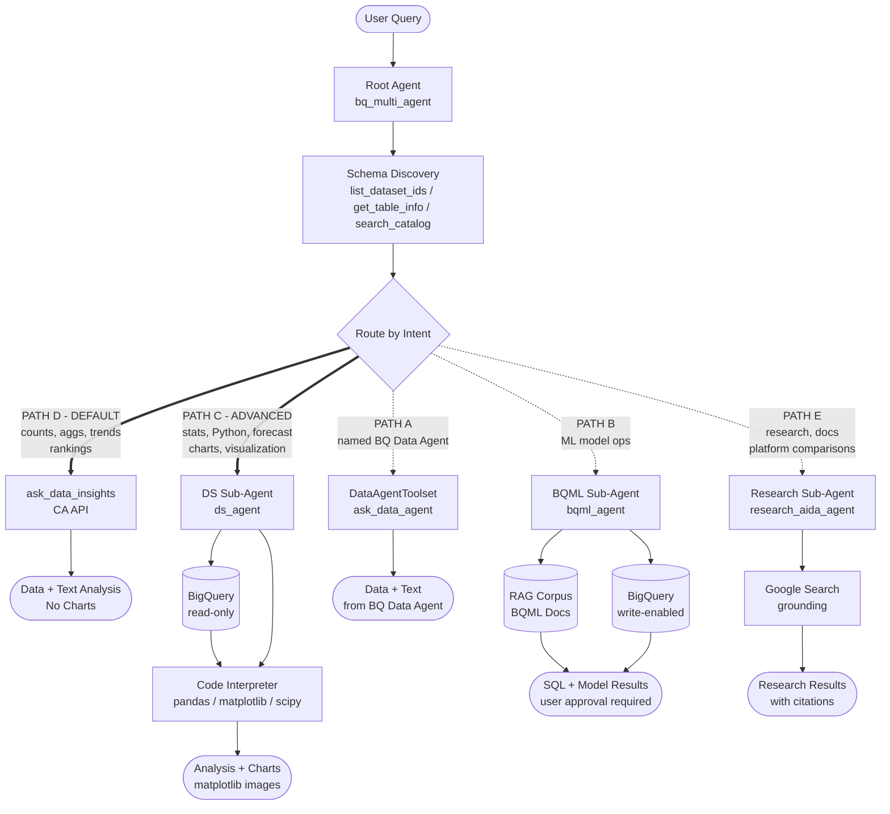

# BigQuery Multi-Agent App

A multi-agent system for BigQuery analytics and data science, built with the
[Google Agent Development Kit (ADK)](https://google.github.io/adk-docs/). Users
interact in natural language; the system handles schema discovery, analytics via
the Conversational Analytics (CA) API, advanced Python analysis, BigQuery ML
operations, access to pre-configured BQ Data Agents, and research on data
analytics topics via Google Search grounding.

## Agent Flow



Thick arrows (`==>`) indicate the two primary paths used for most requests.
Dashed arrows (`-.->`) indicate special-purpose paths.

---

## Quick Deploy

```bash
# 1. Authenticate
gcloud auth application-default login

# 2. Clone, install, and configure
git clone https://github.com/johanesalxd/bq-agent-app.git
cd bq-agent-app && uv sync
cp .env.example .env
# Edit .env: set GOOGLE_CLOUD_PROJECT, AGENT_ENGINE_REGION,
#   GOOGLE_OAUTH_CLIENT_ID, GOOGLE_OAUTH_CLIENT_SECRET,
#   CODE_INTERPRETER_EXTENSION_NAME, BQML_RAG_CORPUS_NAME

# 3. Run locally
uv run adk web

# 4. Deploy to Agent Engine + register in Gemini Enterprise
./deployment/deploy.sh
./deployment/register_gemini_enterprise.sh
```

> See [Setup](#setup) for prerequisite details (OAuth client, Code Interpreter
> Extension, RAG corpus) and [Deployment](#deployment) for advanced options.

---

## How It Works

The root agent uses **intent-based routing** — it infers what the user needs from
context, not keyword matching, and sends the request to the right tool or sub-agent.

```
User: "Show me sales by region last month"
  -> Root agent: standard data question
  -> Calls ask_data_insights with discovered table references
  -> Returns data table and text analysis

User: "Run a significance test comparing region revenue"
  -> Root agent: statistical analysis, needs Python
  -> Delegates to DS sub-agent
  -> DS agent: execute_sql (retrieve data) -> Code Interpreter (scipy, statsmodels)
  -> Returns statistical report + matplotlib charts

User: "Create a churn prediction model"
  -> Root agent: BQML task
  -> Delegates to BQML sub-agent
  -> BQML agent: RAG lookup -> generate SQL -> user approval -> execute

User: "How does BigQuery compare to Snowflake for semi-structured data?"
  -> Root agent: research question, no data access needed
  -> Delegates to Research AIDA sub-agent
  -> Research agent: Google Search -> synthesize findings -> cited answer

User: "Ask order_user_agent about top customers"
  -> Root agent: pre-configured BQ Data Agent reference
  -> Calls DataAgentToolset -> ask_data_agent
  -> Returns CA API response from the user's pre-configured agent
```

### Routing logic

| Priority | Path | Trigger (inferred from intent) | Handler |
|----------|------|-------------------------------|---------|
| 1 | **Data Agent** | User explicitly references a named BQ Data Agent | `DataAgentToolset` |
| 2 | **BQML** | ML model creation, training, evaluation, predictions | BQML sub-agent |
| 3 | **Research** | BigQuery features, platform comparisons, docs, AI/ML concepts | Research AIDA sub-agent |
| 4 | **Advanced** | Statistical testing, custom Python, forecasting, anomaly detection, charts | DS sub-agent |
| 5 | **Default** | Everything else — counts, aggregations, trends, comparisons (no charts) | `ask_data_insights` (CA API) |

The **Default path** handles the vast majority of queries. `ask_data_insights` is
the same backend that powers BQ Agents and Looker Conversational Analytics — it
translates natural-language questions into SQL and returns data and text analysis.
Chart and visualization requests are routed to the DS sub-agent (Advanced path).

---

## Future Improvements

Four areas where this app can be meaningfully extended.

### 1. Agent Evaluation

Integrate the [Gen AI Evaluation Service](https://cloud.google.com/vertex-ai/generative-ai/docs/models/evaluation-overview)
to measure agent quality objectively and catch regressions in CI.

The evaluation service supports:

- **Adaptive rubrics** — dynamically generated pass/fail tests per prompt (the
  recommended starting point)
- **Trajectory evaluation** — verify the agent calls the right tools in the
  right order against a reference sequence
- **Static rubrics** — fixed scoring criteria for dimensions like
  `RESPONSE_QUALITY`, `GROUNDEDNESS`, and `SAFETY`

Workflow:

```python
from vertexai import Client
from vertexai import types

client = Client(project=PROJECT_ID, location=LOCATION)

# Generate responses from the deployed agent
eval_dataset = client.evals.run_inference(model=AGENT_ENDPOINT, src=prompts_df)

# Evaluate with adaptive rubrics
eval_result = client.evals.evaluate(
    dataset=eval_dataset,
    metrics=[types.RubricMetric.GENERAL_QUALITY],
)
eval_result.show()
```

Expected deliverable: `evaluation/` directory with representative prompt
datasets (default path, DS path, BQML path, research path) and a
`run_evaluation.py` script suitable for CI integration.

---

### 2. Guardrail Callbacks

ADK exposes [six callback types](https://google.github.io/adk-docs/callbacks/)
for intercepting and modifying agent behaviour at every stage of the
request-response cycle. This app currently uses only `after_agent_callback`
(to generate memory summaries). The remaining five are unused:

| Callback | Where to apply it |
|---|---|
| `before_model_callback` | Input guardrails — block or rewrite the prompt before the LLM sees it |
| `after_model_callback` | Output safety — redact PII or block harmful content in LLM responses |
| `before_tool_callback` | Tool validation — reject dangerous SQL patterns before `execute_sql` runs |
| `after_tool_callback` | Result masking — strip sensitive column values from BigQuery results |
| `before_agent_callback` | Pre-flight checks — enforce session-level policies before the agent starts |

For managed prompt/response screening, [Model Armor](https://cloud.google.com/security/products/model-armor)
integrates via REST and has a free tier (up to 2 million tokens/month). It
detects prompt injection, jailbreaking, PII leakage, and malicious URLs across
any LLM.

Expected deliverable: `bq_multi_agent_app/callbacks.py` with at minimum
`before_tool_callback` (SQL safety) and `after_model_callback` (PII masking),
registered on the root agent and DS sub-agent.

---

### 3. A2A Protocol

The [Agent-to-Agent (A2A) protocol](https://google.github.io/adk-docs/a2a/)
is an open HTTP standard that lets agents advertise capabilities via an
**agent card** and accept tasks from other agents via an **AgentExecutor**
interface.

Wrapping `bq_multi_agent` as an A2A server makes it discoverable and callable
by any A2A-compatible orchestrator — including other ADK agents and third-party
systems. ADK ships with `A2AServer` and the `AgentExecutor` base class; Agent
Engine supports A2A deployment in preview.

Expected deliverable: an agent card JSON (`deployment/a2a_agent_card.json`),
an executor module (`bq_multi_agent_app/a2a_executor.py`) wrapping the ADK
`Runner`, and a registration script.

---

### 4. MCP Tooling and Agent Skills

**MCP tooling**

ADK supports [`McpToolset`](https://google.github.io/adk-docs/tools-custom/mcp-tools/)
to connect any agent to a Streamable HTTP MCP server. The Research AIDA
sub-agent currently uses `google_search` for free-form retrieval; replacing or
augmenting it with a domain-specific MCP server (e.g., a Cloud Run service
serving BigQuery and Vertex AI documentation) would give it structured,
versioned, citation-rich results.

Self-hosting a docs MCP server on Cloud Run is the practical path — no
publicly hosted Google Cloud docs MCP endpoint is currently available.

**Agent Skills**

[Agent Skills](https://agentskills.io/) is an open standard for packaging
reusable analytics workflows as `SKILL.md` files. Each skill contains YAML
metadata and markdown instructions; an agent loads only the metadata at startup
and pulls the full skill on demand (lean context by default). Skills are
version-controlled alongside the code and supported by OpenCode, Gemini CLI,
and other tools.

Candidate skills for this repo:

| Skill | Description |
|---|---|
| `cohort-analysis` | Step-by-step cohort retention analysis using `order_items` |
| `bqml-model-selection` | Decision guide for choosing the right BQML model type |
| `data-quality-audit` | Null-check, duplicate-check, and distribution summary workflow |

Expected deliverable: `McpToolset` integration in the Research AIDA sub-agent
and 3–5 packaged skills under `.skills/`.

---

## Architecture

```
Root Agent  bq_multi_agent
│
├── BigQueryToolset  [ca_toolset — read-only, per-user OAuth]
│   ask_data_insights  list_dataset_ids  get_dataset_info
│   list_table_ids  get_table_info  search_catalog
│
├── DataAgentToolset  [per-user OAuth]
│   list_accessible_data_agents  get_data_agent_info  ask_data_agent
│
├── Memory Tools  [Vertex AI Memory Bank]
│   PreloadMemoryTool  LoadMemoryTool
│
└── Sub-agents
    │
    ├── DS Sub-Agent  ds_agent
    │   ├── BigQueryToolset  [ds_toolset — read-only, per-user OAuth]
    │   │   execute_sql  forecast  analyze_contribution  detect_anomalies
    │   │   list_dataset_ids  get_dataset_info  list_table_ids
    │   │   get_table_info  get_job_info
    │   ├── Code Interpreter  [VertexAiCodeExecutor]
    │   │   numpy 1.26.4  pandas 2.2.1  matplotlib 3.8.3  scipy 1.12.0
    │   │   seaborn 0.13.2  scikit-learn 1.4.0  statsmodels 0.14.1  Pillow 10.2.0
    │   └── load_artifacts
    │
    ├── BQML Sub-Agent  bqml_agent
    │   ├── BigQueryToolset  [bqml_toolset — write-enabled, per-user OAuth]
    │   │   execute_sql  list_dataset_ids  get_dataset_info
    │   │   list_table_ids  get_table_info
    │   └── rag_response  [BQML documentation corpus]
    │
    └── Research AIDA Sub-Agent  research_aida_agent
        └── google_search  [Google Search grounding — scoped to data/AI topics]
```

### Technology stack

| Component | Details |
|-----------|---------|
| Framework | Google ADK 1.28+ |
| Model | Gemini 3.1 Pro Preview (`MODEL_NAME` in `constants.py`) |
| CA API | `ask_data_insights` — same backend as BQ Agents and Looker CA |
| Auth | Per-user OAuth via `external_access_token_key` — token read from session state on every tool call, no refresh attempt |
| Code execution | `VertexAiCodeExecutor` + pre-provisioned Code Interpreter Extension |
| BQML docs | Vertex AI RAG corpus (`text-embedding-005`, `us-west4`) |
| Memory | Vertex AI Memory Bank via `PreloadMemoryTool` / `LoadMemoryTool` |

---

## Prerequisites

- Python 3.12
- [`uv`](https://docs.astral.sh/uv/getting-started/installation/) package manager
- Google Cloud project with BigQuery enabled
- `gcloud` CLI authenticated: `gcloud auth application-default login`

### Required GCP APIs

```bash
gcloud services enable aiplatform.googleapis.com
gcloud services enable bigquery.googleapis.com
gcloud services enable cloudresourcemanager.googleapis.com
gcloud services enable logging.googleapis.com        # For Agent Engine log ingestion
gcloud services enable telemetry.googleapis.com      # For Agent Engine trace ingestion
gcloud services enable discoveryengine.googleapis.com  # Gemini Enterprise only
```

### Required IAM roles

| Role | Purpose |
|------|---------|
| Vertex AI User | Agent Engine, Code Interpreter, RAG |
| BigQuery User | Query execution |
| BigQuery Data Viewer | Table / schema access |
| Cloud Trace Agent (`roles/cloudtrace.agent`) | Write traces (telemetry) |
| Logs Writer (`roles/logging.logWriter`) | Write logs (telemetry) |

---

## Setup

Complete these steps once before running the app for the first time.

> **ADC note:** Do not set `GOOGLE_APPLICATION_CREDENTIALS`. The app uses
> Application Default Credentials (ADC) via `gcloud auth application-default login`.
> Setting `GOOGLE_APPLICATION_CREDENTIALS` to a service account key overrides ADC
> and will cause auth failures for the per-user OAuth flows.

> **Shell environment note:** If your shell exports `GOOGLE_CLOUD_LOCATION` (e.g.
> from `.zshrc`), it overrides `.env`. The app and all setup scripts call
> `load_dotenv(..., override=True)` to handle this correctly. Avoid exporting
> region vars globally, or ensure your `.env` values are consistent with your shell.

### 1. OAuth 2.0 client (required)

BigQuery and Data Agent toolsets authenticate each user via OAuth. You need an
OAuth 2.0 client registered in Google Cloud Console.

1. Cloud Console → APIs & Services → Credentials → **Create OAuth 2.0 Client ID**
2. Application type: **Web application**
3. Add authorised redirect URIs:
   - Local ADK web UI: `http://localhost:8000/oauth2callback`
   - Gemini Enterprise: `https://vertexaisearch.cloud.google.com/oauth-redirect`
   - Gemini Enterprise: `https://vertexaisearch.cloud.google.com/static/oauth/oauth.html`
4. Copy **Client ID** and **Client Secret** to `.env`:
   ```
   GOOGLE_OAUTH_CLIENT_ID=your-client-id.apps.googleusercontent.com
   GOOGLE_OAUTH_CLIENT_SECRET=your-client-secret
   ```

### 2. Code Interpreter Extension (required for DS agent)

`VertexAiCodeExecutor` requires a pre-provisioned Code Interpreter Extension.
Create one once and pin it in `.env` to prevent new extensions being created on
every agent start.

```bash
uv run python setup/vertex_extensions/setup_vertex_extensions.py
# Copy the printed resource name to CODE_INTERPRETER_EXTENSION_NAME in .env
```

To clean up duplicate extensions:

```bash
# Preview first
uv run python setup/vertex_extensions/cleanup_vertex_extensions.py \
    --dry-run --keep-id YOUR_EXTENSION_ID

# Then delete
uv run python setup/vertex_extensions/cleanup_vertex_extensions.py \
    --keep-id YOUR_EXTENSION_ID
```

See [`setup/vertex_extensions/VERTEX_EXTENSIONS_GUIDE.md`](setup/vertex_extensions/VERTEX_EXTENSIONS_GUIDE.md)
for full details.

### 3. BQML RAG corpus (required for BQML agent)

The BQML agent uses a Vertex AI RAG corpus for documentation lookup. The script
deploys the corpus and writes `BQML_RAG_CORPUS_NAME` to `.env` automatically.

```bash
uv run python setup/rag_corpus/create_bqml_corpus.py
```

> **Region note:** The script defaults to `us-west4` (`RAG_LOCATION` env var).
> New GCP projects typically have higher Vertex AI RAG quota there than in
> `us-central1`. Override by setting `RAG_LOCATION` in `.env` before running.

---

## Running Locally

```bash
uv run adk web
```

Open `http://localhost:8000` in your browser. On first tool use, you will be
prompted to complete an OAuth flow for your BigQuery credentials.

### With Memory Bank

Memory Bank persists conversation context across sessions. It requires a deployed
Agent Engine instance as the backing store (see [Deployment](#deployment)).

```bash
# After deploying, set AGENT_ENGINE_ID in .env (numeric suffix of the resource name),
# then run:
uv run adk web --memory_service_uri=agentengine://$AGENT_ENGINE_ID
```

### With local telemetry (sends traces to Cloud Trace)

```bash
uv run adk web --otel_to_cloud
```

---

## Deployment

### Agent Engine

The app deploys to Vertex AI Agent Engine using the ADK CLI. Deploying from source
avoids serialization issues with `VertexAiCodeExecutor`.

**Prerequisites:** Complete all Setup steps above and ensure `.env` has
`GOOGLE_CLOUD_PROJECT`, `AGENT_ENGINE_REGION`, `CODE_INTERPRETER_EXTENSION_NAME`,
and `BQML_RAG_CORPUS_NAME` set.

> **OAuth credentials in `.env`:** `GOOGLE_OAUTH_CLIENT_ID` and
> `GOOGLE_OAUTH_CLIENT_SECRET` are **not** used by the deployed agent code — the
> agent reads the user's OAuth token directly from session state via
> `external_access_token_key`. These credentials are only needed by
> `register_gemini_enterprise.sh` to create the Gemini Enterprise auth resource.
> Keep them in `.env` so the registration script can find them.

```bash
chmod +x deployment/deploy.sh
./deployment/deploy.sh
```

`deploy.sh` writes `AGENT_ENGINE_RESOURCE_NAME` and `AGENT_ENGINE_ID` to `.env`
automatically after a successful deployment.

**To deploy and delete the previous engine in one step:**

```bash
./deployment/deploy.sh --cleanup
```

This deploys the new engine, updates `.env`, then deletes the old engine
(using `?force=true` to cascade-delete child sessions).

**To update an existing deployment without creating a new engine:**

```bash
./deployment/deploy.sh --agent_engine_id=ENGINE_ID
```

`deploy.sh` configures Memory Bank automatically with 5 memory topics
(see [Memory Bank](#memory-bank) for details).

**Smoke test:**

```bash
uv run python deployment/test_deployment.py
```

**Session management via REST:**

```bash
ACCESS_TOKEN=$(gcloud auth print-access-token)

# List sessions
curl -s -H "Authorization: Bearer ${ACCESS_TOKEN}" \
  "https://us-central1-aiplatform.googleapis.com/v1beta1/${AGENT_ENGINE_RESOURCE_NAME}/sessions"

# Delete a session
curl -s -X DELETE -H "Authorization: Bearer ${ACCESS_TOKEN}" \
  "https://us-central1-aiplatform.googleapis.com/v1beta1/${AGENT_ENGINE_RESOURCE_NAME}/sessions/SESSION_ID"
```

### Gemini Enterprise

After deploying to Agent Engine, register the agent to surface it in the Gemini
Enterprise console.

**Prerequisites:** `AGENT_ENGINE_RESOURCE_NAME` and `GEMINI_ENTERPRISE_APP_ID`
must be set in `.env`. Find your app ID in the Gemini Enterprise console under
your app settings.

```bash
chmod +x deployment/register_gemini_enterprise.sh
./deployment/register_gemini_enterprise.sh
```

The script:
1. Deletes any existing custom agent registrations (preserves Google built-in agents).
2. Recreates the authorization resource with your OAuth credentials.
3. Registers the agent and prints the agent ID on success.

> **Endpoint location:** The Discovery Engine endpoint defaults to `global`
> (most Gemini Enterprise apps). Override with `GEMINI_ENTERPRISE_ENDPOINT_LOCATION=us`
> or `=eu` in `.env` if your app is region-scoped.

### Cloud Run

```bash
uv run adk deploy cloud_run \
  --project=your-project-id \
  --region=us-central1 \
  --service_name=bq-agent-app \
  --trace_to_cloud \
  --with_ui \
  ./bq_multi_agent_app
```

---

## Observability

Agent Engine provides two independent telemetry settings, both controlled via
environment variables in `.env` and forwarded to the deployed container by
`deploy.sh`.

| Setting | Env Var | What it captures | PII risk |
|---------|---------|-----------------|----------|
| Traces + logs | `GOOGLE_CLOUD_AGENT_ENGINE_ENABLE_TELEMETRY=true` | Agent steps, tool calls, latency — no prompt content | Low |
| Prompt/response capture | `OTEL_INSTRUMENTATION_GENAI_CAPTURE_MESSAGE_CONTENT=true` | Full user messages and model responses in traces | **High** |

Both are enabled by default in `.env`. To disable prompt capture (e.g. in
production with PII concerns), comment out `OTEL_INSTRUMENTATION_GENAI_CAPTURE_MESSAGE_CONTENT`
and redeploy.

**Required APIs** (one-time):

```bash
gcloud services enable telemetry.googleapis.com
gcloud services enable logging.googleapis.com
```

**Where to view:**

- Agent Engine observability dashboard:
  `console.cloud.google.com/vertex-ai/agents/agent-engines` → select your instance → **Observability**
- Cloud Trace: `console.cloud.google.com/traces`
- Cloud Logging (Logs Explorer): filter by resource type
  `Vertex AI Agent Builder Reasoning Engine`

**After changing telemetry settings**, redeploy to apply:

```bash
./deployment/deploy.sh --agent_engine_id=ENGINE_ID
```

**Local telemetry** (sends traces to Cloud Trace during `adk web`):

```bash
uv run adk web --otel_to_cloud
```

---

## Usage Guide

The examples below use the `thelook_ecommerce` dataset (orders, order_items,
products, users, inventory_items, events, distribution_centers) as a reference.
Adapt the table and dataset names to your own project.

### Default Path — Conversational Analytics (CA API)

The root agent handles most data questions directly via `ask_data_insights`.
The CA API generates SQL internally — you do not need to write SQL.

**Schema discovery**

```
"What datasets are available in my project?"
"Show me the tables in the thelook_ecommerce dataset"
"What columns does the order_items table have?"
"Find tables related to inventory"
```

**Aggregations and rankings**

```
"How many orders were placed last month?"
"Top 10 product categories by total revenue"
"Average order value by customer country"
"Which brands have the highest return rate?"
```

**Trends and comparisons**

```
"Monthly order count trend for the past year"
"Compare revenue between Men's and Women's departments"
"What percentage of orders were returned vs completed last quarter?"
```

The agent runs schema discovery first (list datasets → list tables → get table
info), then calls `ask_data_insights` with fully-qualified table references.
Results include data tables and text analysis. For charts, use the Advanced path
examples below.

> **Tip:** If you want both data analysis and a chart, include the visualization
> request in your first message (e.g., "Show me monthly sales trend as a bar chart").
> This routes directly to the DS sub-agent, which handles both data retrieval and
> chart generation in one pass. Asking for a chart after a text-only analysis
> requires re-querying the data.

---

### Advanced Path — DS Sub-Agent

Triggered when the request requires Python code execution, statistical testing,
or advanced BigQuery tools (`forecast`, `analyze_contribution`, `detect_anomalies`).

**Statistical analysis**

```
"Is there a statistically significant difference in return rates between
 product categories? Use the order_items and products tables."

"What is the Pearson correlation between user age and average order value?"

"Run a t-test comparing average sale prices in the Men's vs Women's
 departments from the order_items and products tables."
```

**Advanced visualization**

```
"Create a heatmap of order counts by day of week and hour of day"

"Plot the distribution of sale prices with a histogram and overlay a KDE curve"

"Show a scatter plot of product cost vs retail price, coloured by department"
```

**Forecasting and anomaly detection**

```
"Forecast daily order counts for the next 30 days with 80% confidence intervals
 using the orders table"

"Detect anomalies in daily revenue over the past year from order_items"

"What drove the change in revenue between Q1 and Q2?
 Use the order_items table for contribution analysis."
```

**Multi-step analysis**

```
"Calculate customer lifetime value from order_items:
 total spend, order count, and average days between orders per user.
 Then segment users into Bronze / Silver / Gold tiers."

"Cohort analysis: for users who placed their first order each month,
 what fraction placed a second order within 30 days?"
```

The DS agent has its own BigQuery tools and Code Interpreter with numpy, pandas,
matplotlib, scipy, seaborn, scikit-learn, and statsmodels pre-installed.

---

### BQML Path — BQML Sub-Agent

Triggered for BigQuery ML model operations. The agent looks up BQML syntax from
the RAG corpus, generates SQL, and asks for user approval before executing.
Model training can take several minutes to hours.

**Model creation**

```
"Create a logistic regression model to predict order returns.
 Use the order_items and products tables in thelook_ecommerce."

"Build an ARIMA_PLUS forecasting model for daily order counts
 using the orders table. Use 'created_at' as the timestamp column."

"Create a k-means clustering model with 4 clusters to segment users
 by age, country, and total lifetime spend."
```

**Model inspection**

```
"List all BQML models in the thelook_ecommerce dataset"
"Show training info for my logistic regression model"
"Evaluate the return prediction model — show accuracy, precision, and recall"
"What features does the clustering model use?"
```

**Predictions**

```
"Use the return prediction model to score the 100 most recent orders"
"Forecast daily orders for the next 14 days using the ARIMA model"
"Run ML.PREDICT on the k-means model and show which cluster each user falls into"
```

The agent always presents generated SQL for approval before execution. INFORMATION_SCHEMA
queries and data exploration do not require approval.

---

### Data Agent Path — Pre-configured BQ Data Agents

Triggered when the user explicitly references a named BQ Data Agent by name.
These are agents created in the BigQuery console (BQ Agents / Conversational Analytics).

**Discovering available agents**

```
"Which data agents do I have access to?"
"List my available BQ data agents"
```

**Querying a specific agent**

```
"Ask order_user_agent about the top 10 customers by revenue last quarter"
"Ask inventory_product_agent which products are running low on stock"
"Ask order_user_agent what is the average order value by country this month"
"Ask inventory_product_agent to show me the distribution of products by category"
```

Data Agents are identified by resource names of the form
`projects/<PROJECT_ID>/locations/global/dataAgents/<AGENT_ID>`. The root agent
resolves friendly names automatically via `list_accessible_data_agents`.

No code changes are needed to use your Data Agents — they are accessible as
long as they exist in the same GCP project and the user has IAM access.

**Example session**

```
You:   "What data agents do I have access to?"
Agent: lists order_user_agent and inventory_product_agent

You:   "Ask order_user_agent to calculate the average order value by traffic source"
Agent: routes to ask_data_agent → order_user_agent queries orders, order_items,
       and users tables → returns data table and text analysis

You:   "Ask inventory_product_agent which products are running low on stock"
Agent: routes to ask_data_agent → inventory_product_agent queries inventory_items
       and products tables → returns stock-level analysis
```

The key pattern is **"Ask \<agent\_name\> to \<your question\>"**. The root agent
handles discovery and routing — you just reference the agent by its display name.

**Creating your own CA API Data Agents**

The agents above (`order_user_agent` and `inventory_product_agent`) are created
via the Conversational Analytics API and backed by `thelook_ecommerce` tables.
For a companion repo that shows how to create, deploy, and register CA API Data
Agents as standalone ADK agents on Agent Engine and Gemini Enterprise, see
[bq_caapi_ge](https://github.com/johanesalxd/random-stuff/tree/main/bq_caapi_ge).

---

### Research Path — Research AIDA Sub-Agent

Triggered when the user asks about BigQuery features, platform comparisons,
data analytics concepts, AI/ML topics, or best practices — questions that
require current documentation rather than data access.

**Platform comparisons**

```
"How does BigQuery compare to Snowflake for handling semi-structured JSON data?"
"What are the key differences between Databricks and BigQuery for ML workloads?"
"Which is better for streaming ingestion: BigQuery or Redshift?"
```

**Feature and syntax lookups**

```
"What are the BigQuery quotas for on-demand queries?"
"How does BigQuery handle partition pruning for nested repeated fields?"
"What is the difference between APPROX_COUNT_DISTINCT and COUNT(DISTINCT) in BigQuery?"
```

**Best practices and architecture**

```
"What are best practices for BigQuery slot reservation vs on-demand pricing?"
"How should I design a BigQuery schema for high-cardinality time-series data?"
"What are Google's recommendations for Dataflow vs BigQuery for ETL pipelines?"
```

**AI/ML concepts**

```
"What is the difference between BQML logistic regression and AutoML Tables?"
"How does Vertex AI Feature Store integrate with BigQuery?"
"What are the tradeoffs between fine-tuning Gemini vs using it with RAG?"
```

Responses include a summary, supporting details, and cited source URLs.

---

### Memory Bank

When running with Memory Bank (requires Agent Engine deployment), the agent
remembers context across sessions automatically.

**What gets stored across sessions:**

| Memory topic | What it captures |
|---|---|
| `USER_PERSONAL_INFO` | Your team, role, organisational context |
| `USER_PREFERENCES` | Preferred chart types, analysis style, currency |
| `KEY_CONVERSATION_DETAILS` | Past analysis conclusions and milestones |
| `EXPLICIT_INSTRUCTIONS` | Persistent instructions you give the agent |
| `data_analysis_context` | Frequently used datasets, tables, domain context |

**Telling the agent what to remember:**

```
"Remember that I always work with the thelook_ecommerce dataset"
"My team focuses on the Women's Apparel department"
"I prefer bar charts over pie charts"
"Always show results in USD"
```

**How it works across sessions:**

```
Session 1:
  You: "Remember I focus on the Women's department in thelook_ecommerce"
  Agent: stores in memory

Session 2 (new conversation):
  You: "Show me this month's sales trend"
  Agent: (recalls Women's department + thelook_ecommerce context automatically)
       -> filters results to Women's department without being told
```

---

## Project Structure

```
bq-agent-app/
├── pyproject.toml
├── .env.example
├── bq_multi_agent_app/
│   ├── __init__.py                    # ADK discovery re-export
│   ├── agent.py                       # Root agent definition
│   ├── constants.py                   # MODEL_NAME and shared env setup
│   ├── tools.py                       # ca_toolset, ds_toolset, data_agent_toolset
│   ├── prompts.py                     # Root agent prompt (intent-based routing)
│   ├── .agent_engine_config.json      # Memory Bank config for CLI deploy
│   ├── requirements.txt               # Python deps for Agent Engine container
│   └── sub_agents/
│       ├── __init__.py
│       ├── bqml_agents/
│       │   ├── agent.py               # BQML sub-agent
│       │   ├── prompts.py
│       │   └── tools.py               # bqml_toolset (execute_sql + discovery, write-enabled)
│       ├── ds_agents/
│       │   ├── agent.py               # DS sub-agent: ds_toolset + Code Interpreter
│       │   └── prompts.py
│       └── research_agents/
│           ├── __init__.py
│           ├── agent.py               # Research AIDA sub-agent: google_search
│           └── prompts.py
├── deployment/
│   ├── deploy.sh                      # Agent Engine deployment via ADK CLI
│   ├── register_gemini_enterprise.sh  # Gemini Enterprise registration
│   └── test_deployment.py             # Smoke test for deployed instance
├── setup/
│   ├── probe_code_interpreter.py      # Verify available Code Interpreter libraries
│   ├── rag_corpus/
│   │   └── create_bqml_corpus.py      # Vertex AI RAG corpus provisioning
│   └── vertex_extensions/
│       ├── setup_vertex_extensions.py
│       ├── cleanup_vertex_extensions.py
│       ├── utils.py
│       └── VERTEX_EXTENSIONS_GUIDE.md
└── tests/
    ├── conftest.py
    ├── test_agent.py
    ├── test_bqml_tools.py
    ├── test_prompts.py
    └── test_tools.py
```

---

## Security

- Root and DS toolsets use `WriteMode.BLOCKED` (read-only)
- BQML toolset uses `WriteMode.ALLOWED` (required for `CREATE MODEL`)
- Per-user OAuth ensures each user's IAM permissions are enforced end-to-end
- Store all credentials in `.env` (git-ignored); never hardcode secrets
- Do not set `GOOGLE_APPLICATION_CREDENTIALS` — use ADC (`gcloud auth application-default login`)
- `OTEL_INSTRUMENTATION_GENAI_CAPTURE_MESSAGE_CONTENT=true` logs full prompt/response content; disable in environments with PII concerns

---

## Known Issues

### Gemini Enterprise: Stale OAuth Token

**Symptom:** The agent responds with credential errors on every tool call
("trouble accessing the project due to a technical issue with my credentials",
or "The credentials do not contain the necessary fields need to refresh the
access token") even in brand-new sessions.

**Root cause:** Gemini Enterprise caches OAuth grants server-side at the user
level, keyed by the auth resource ID (`AUTH_ID`). When a previously-issued
access token is revoked or expires, Gemini Enterprise may continue serving the
same stale token to new sessions. The agent reads the token from session state
via `external_access_token_key` on every tool call with no refresh attempt —
so if the token in state is invalid, all BQ tool calls fail immediately.

You can confirm a stale token by checking the session state and validating the
token directly:

```bash
# Read the token from session state
ACCESS_TOKEN=$(gcloud auth print-access-token)
curl -s -H "Authorization: Bearer ${ACCESS_TOKEN}" \
  "https://us-central1-aiplatform.googleapis.com/v1beta1/${AGENT_ENGINE_RESOURCE_NAME}/sessions/SESSION_ID" \
  | python3 -c "import json,sys; s=json.load(sys.stdin); print(s['sessionState'].get('bq-oauth-3','NOT FOUND'))"

# Check if the token is valid
BQ_TOKEN="<token from above>"
curl -s "https://www.googleapis.com/oauth2/v1/tokeninfo?access_token=${BQ_TOKEN}"
# If output contains "error": "invalid_token" the token is stale
```

**Fix:** Create a new auth resource by changing `AUTH_ID` in `.env` to a new
value, then redeploy and re-register. Gemini Enterprise has no cached grant for
the new resource ID and will prompt the user for fresh consent.

```bash
# 1. Change AUTH_ID in .env (e.g. bq-oauth → bq-oauth-2)
#    The value must be alphanumeric with hyphens; pick any new unique name.

# 2. Redeploy (bakes the new AUTH_ID into the engine environment)
./deployment/deploy.sh --cleanup

# 3. Re-register (creates the new auth resource, deletes the old one)
./deployment/register_gemini_enterprise.sh
```

After re-registering, start a new conversation in Gemini Enterprise. The first
BigQuery tool call should trigger a fresh OAuth consent prompt.

> **Why revoking the token doesn't help:** Revoking the token from
> https://myaccount.google.com/permissions invalidates the token, but Gemini
> Enterprise's server-side grant cache is not cleared. The next session receives
> the same revoked token. Changing `AUTH_ID` is the reliable workaround.

### CA API Chart / Visualization Limitations

The Conversational Analytics API supports Vega-Lite chart generation server-side.
However, charts are blocked or lost at multiple levels depending on how you call
the API and where you render the response.

**Tool comparison:**

| | ADK `ask_data_insights` (PATH D) | ADK `ask_data_agent` (PATH A) | Python SDK `DataChatServiceClient` |
|---|---|---|---|
| `noImage` API option | Yes — hardcoded | No | No |
| Anti-chart system instruction | Yes — "STRICTLY FORBIDDEN" | No — uses the data agent's own instructions | No — caller controls instructions |
| Chart response handler in ADK | None — silently dropped | None — silently dropped | N/A — caller parses the stream |
| Returns Vega-Lite specs | No | No (API may return them; ADK discards) | Yes (`chart.result.vega_config`) |
| Stateful multi-turn | No | No | Yes (conversation resource or message replay) |

**Why charts don't reach the user — two independent blockers:**

1. **ADK layer:** `ask_data_insights` actively suppresses charts via the
   `options.chart.image.noImage` API option and a hardcoded system instruction.
   `ask_data_agent` does not suppress them, but the ADK stream handler only
   processes `text`, `schema`, and `data` message types — `chart` messages are
   silently ignored regardless.
2. **Gemini Enterprise layer:** Even if an ADK tool returned a Vega-Lite spec,
   the GE web app has no mechanism to render charts from third-party ADK agents.
   Google's built-in Data Insights agent renders charts through a first-party UI
   integration that custom Agent Engine agents do not have access to. ADK agent
   responses are rendered as text/markdown only.

The Python SDK (`google-cloud-geminidataanalytics`) bypasses blocker 1 — it
returns the full Vega-Lite spec. But blocker 2 remains: you can render the spec
in a notebook (via Altair) or save it as a PNG, but you cannot display it inline
in Gemini Enterprise from a custom agent.

**How this system handles it:** Visualization requests are routed to PATH C (DS
sub-agent), which queries BigQuery directly and generates charts via Code
Interpreter (matplotlib). Code Interpreter produces image artifacts that Gemini
Enterprise can display inline. This is why requesting a chart after a text-only
analysis requires re-querying — the CA API result from PATH D cannot be passed
to the DS sub-agent's Code Interpreter.

**Reference:**
- [Render a visualization (Python SDK)](https://docs.cloud.google.com/gemini/data-agents/conversational-analytics-api/render-visualization)
- [Build a data agent using the Python SDK](https://docs.cloud.google.com/gemini/data-agents/conversational-analytics-api/build-agent-sdk)
- [CA API Known Limitations](https://docs.cloud.google.com/gemini/data-agents/conversational-analytics-api/known-limitations)
- ADK source: `google/adk/tools/bigquery/data_insights_tool.py` (`noImage` + system instruction)
- ADK source: `google/adk/tools/data_agent/data_agent_tool.py` (no `chart` message handler)

---

## Related Resources

- [Google ADK Documentation](https://google.github.io/adk-docs/)
- [ADK BigQuery Tools](https://google.github.io/adk-docs/integrations/bigquery/)
- [ADK Callbacks](https://google.github.io/adk-docs/callbacks/)
- [ADK MCP Tools](https://google.github.io/adk-docs/tools-custom/mcp-tools/)
- [ADK A2A Protocol](https://google.github.io/adk-docs/a2a/)
- [BigQuery Conversational Analytics](https://cloud.google.com/bigquery/docs/conversational-analytics-overview)
- [Vertex AI Agent Engine](https://cloud.google.com/vertex-ai/generative-ai/docs/agent-engine/overview)
- [Agent Engine Observability](https://cloud.google.com/agent-builder/agent-engine/manage/tracing)
- [Gen AI Evaluation Service](https://cloud.google.com/vertex-ai/generative-ai/docs/models/evaluation-overview)
- [Model Armor](https://cloud.google.com/security/products/model-armor)
- [Agent Skills](https://agentskills.io/)
- [Gemini Enterprise](https://cloud.google.com/products/gemini/enterprise)
- [Vertex AI Memory Bank](https://cloud.google.com/vertex-ai/generative-ai/docs/agent-engine/memory-bank)

